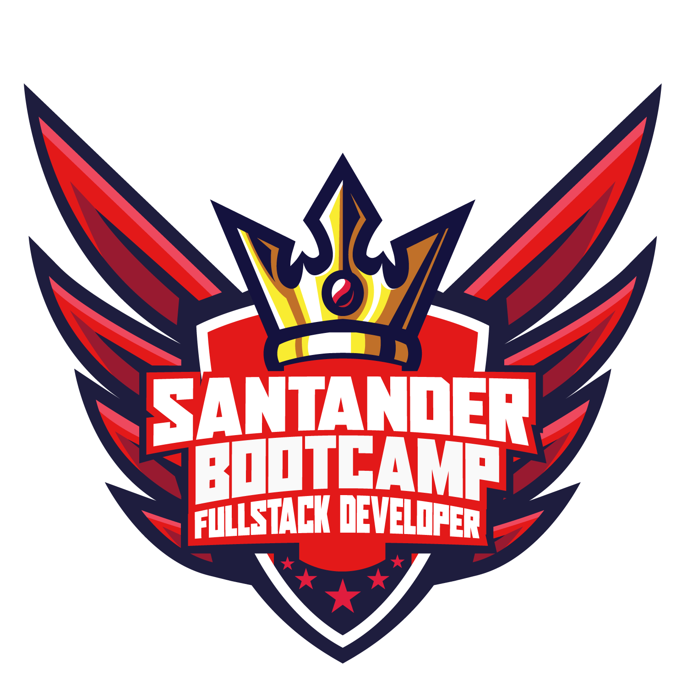

# Bootcamp Santander Fullstack Developer 

> Este repositório têm a finalidade de documentar todo o aprendizado, as atividades e os projetos realizados no Bootcamp Santander Fullstack Developer. 
>
> O Bootcamp foi organizado pela [Santander | Bolsas](https://www.becas-santander.com/pt_br/index.html) é a [Digital Innovation One - DIO](https://web.dio.me/home).

---

### Assuntos abordados:

- [MÓDULO II - HTML/CSS/JS](modulos/modulo_II-html-css-js)
- [MÓDULO III - Angular](modulos/modulo_III-angular)
- [MÓDULO IV - Java](modulos/modulo_IV-java)
- [MÓDULO V - Spring Framework](modulos/modulo_V-spring)

---

### Desafios de código

- [Desafios Iniciais - JavaScript](modulos/modulo_II-html-css-js/aulas/14-desafios-iniciais-js)
- [Desafios Intermediários - JavaScript](modulos/modulo_III-angular/aulas/10-desafios-intermediarios-js)
- [Desafios Iniciais - Java](modulos/modulo_IV-java/aulas/10-desafios-iniciais-java)
- [Desafios Intermediários - Java](modulos/modulo_V-spring/aulas/05-desafios-intermediarios-java)

---

### Desafios de projeto

- [Recriando a página inicial do Instagram](modulos/modulo_II-html-css-js/aulas/03-recriando-pagina-inicial-instagram)
- [Introdução Prática ao TypeScript](modulos/modulo_II-html-css-js/aulas/18-introducao-pratica-typescript)
- [Criando o front-end de um e-commerce utilizando Angular](modulos/modulo_III-angular/aulas/11-como-criar-um-frontend-de-ecommerce-com-angular)
- [Criando um Banco Digital com Java e Orientações a Objetos](modulos/modulo_IV-java/aulas/11-criando-banco-digital)
- [Explorando Padrões de Projetos na Prática com Java](modulos/modulo_V-spring/aulas/06-explorando-padroes-de-projetos)

